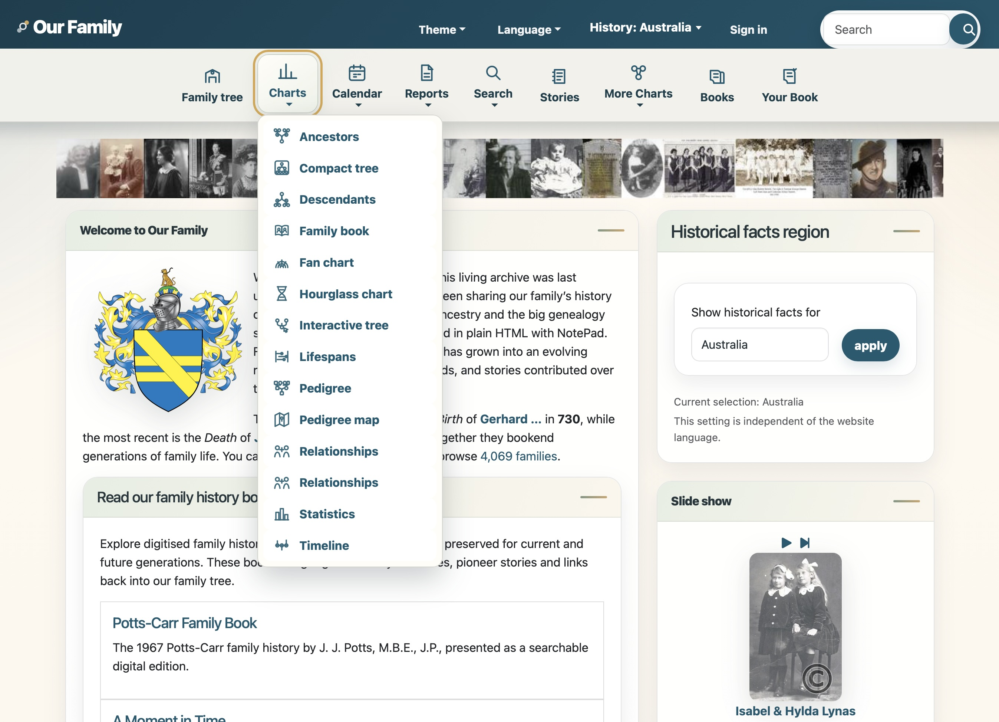
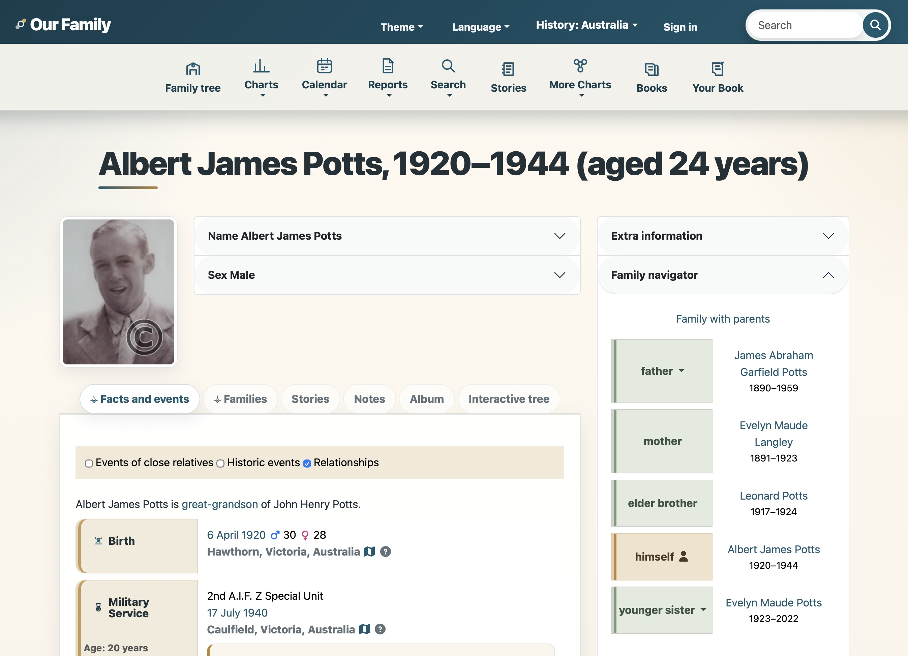

# Potts Modern Theme for webtrees

Potts Modern is a standalone, responsive heritage theme for webtrees 2.2.x. It combines a dark teal navigation header, parchment-inspired cards, modern SVG icons, improved individual pages, styled facts and events, family navigator styling and refreshed default portrait silhouettes.

This is currently a beta release intended for testing on non-production or well-backed-up webtrees sites.

## Screenshots

### Home page

### Individual page

## Features
